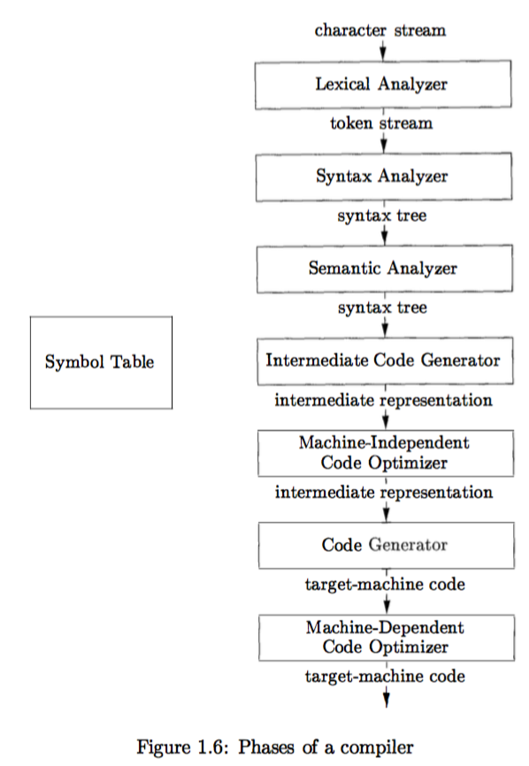
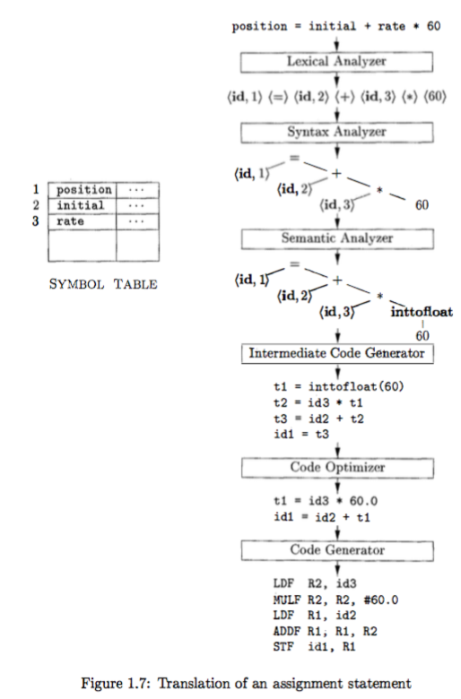

# Chapter 1 Introduction

Programming languages are notations for describing computations to people and to machines

Before a program can be run, it first must be translated into a form in which it can be executed by a computer. The software systems that do this translation are called **compilers**

the book is about how to **design and implement** compilers

in this Chapter

- introduce the different forms of language translators
- give a high level overview of the structure of a typical compiler
- discuss the trends in programming languages and machine architecture that are shaping compilers
- include some observations on the relationship between compiler design and computer-science theory and an outline of the applications of compiler technology that go beyond compilation
- end with a brief outline of key programming-language concepts that will be needed for our study of compilers

## 1.1 Language Processors

a compiler is a program that can read a program in one language (the **source** language) and translate it into an equivalent program in another language (the **target** language)

an important role of the compiler is to **report any errors** in the source program that it detects during the translation process

- interpreter: (another kind of language processor) directly execute the operations specified in the source program on inputs supplied by the user
- compiler: produce a target program as a translation
- advantages: the machine-language target program produced by a compiler is usually much faster than an interpreter at mapping inputs to outputs; interpreter can usually give better error diagnostics than a compiler (because it executes the source program statement by statement)

the process of creating an executable target program

1. a source program may be divided into modules stored in separate files (the task of collecting the source program is sometimes entrusted to a separate program, called a **preprocessor**, which may also expand shorthands, called macros, into source language statements)
2. the modified source program is then fed to a compiler. The compiler may produce an assembly-language program as its output, because assembly language is easier to produce as output and is easier to debug
3. the assembly language is then processed by a program called an **assembler** that produces relocatable machine code as its output
4. large programs are often compiled in pieces, so the relocatable machine code may have to be linked together with other relocatable object files and library files into the code that actually runs on the machine. the **linker** resolves external memory addresses, where the code in one file may refer to a location in another files
5. the **loader** then puts together all of the executable object files into memory for execution

## 1.2 The Structure of a Compiler

treat a **compiler** as a single box that maps a source program into a semantically equivalent target program. if we open up the box a little, we see that there are two parts to this mapping: **analysis** and **synthesis**

- analysis part: breaks up the source program into constituent pieces and imposes a grammatical structure on them, then uses this structure to create an intermediate representation of the source program; if detects that the source program is either syntactically ill formed or semantically unsound, it must provide informative messages; collects information about the source program and stores it in a data structure called a **symbol table**
- synthesis part: constructs the desired target program from the intermediate representation and the information in the **symbol table**
- the analysis part is called the **front end** of the compiler; the synthesis part is the **back end**

compilation process operates as a sequence of **phases**, each of which transforms one representation of the source program to another

some compilers have a machine-independent optimization phase between the front end and the back end, to perform transformations on the intermediate representation, so that the back end can produce a better target program

### 1.2.1 Lexical Analysis

the first phase of a compiler: **lexical analysis** or **scanning**

the lexical analyzer **reads** the stream of characters making up the source program and **groups** the characters into meaningful sequences (**lexemes**). for each lexeme, the lexical analyzer produces as output a **token** of the form **<token-name, attribute-value>**. token passes on to the subsequent phase **syntax analysis**

token

- token-name: an abstract symbol, used during syntax analysis
- attribute-value: points to an entry in the symbol table for the token
- example: position=initial+rate*60
  - position: a **lexeme** that would be mapped into a token <id,1>, where **id** is an abstract symbol standing for identifier and **1** points to the symbol-table entry for position
  - =: a **lexeme** that is mapped into the token <=>, which needs no attribute-value
  - initial: a **lexeme** that is mapped into the token <id,2>
  - +: a **lexeme** that  is mapped into the token <+>
  - rate: a **lexeme** that is mapped into the token <id,3>
  - \*: a **lexeme** that is mapped into the token <\*>
  - 60: a **lexeme** that is mapped into the token <60>
  - blanks: separating the lexemes, would be discarded by the lexical analyzer
  - result: <id,1> <=> <id,2> <+> <id,3> <\*> <60>

### 1.2.2 Syntax Analysis

the second phase of the compiler: syntax analysis or parsing

the parser uses the first components of the tokens produced by the lexical analyzer to create a tree-like intermediate representation that depicts the grammatical structure of the token stream.

syntax tree: a typical representation, each interior node represents an **operation** and the children of the node represent the **arguments** of the operation (the tree shows the order in which the operations in the assignment are to be performed)

### 1.2.3 Semantic Analysis

the semantic analyzer: uses the **syntax tree** and the information in the **symbol table** to check the source program for semantic consistency with the language definition; gathers type information and saves it in either the syntax tree or the symbol table (for subsequent use during intermediate-code generation) 

## 1.3 The Evolution of Programming Languages

## 1.4 The Science of Building a Compiler

## 1.5 Applications of Compiler Technology

## 1.6 Programming Language Basics
