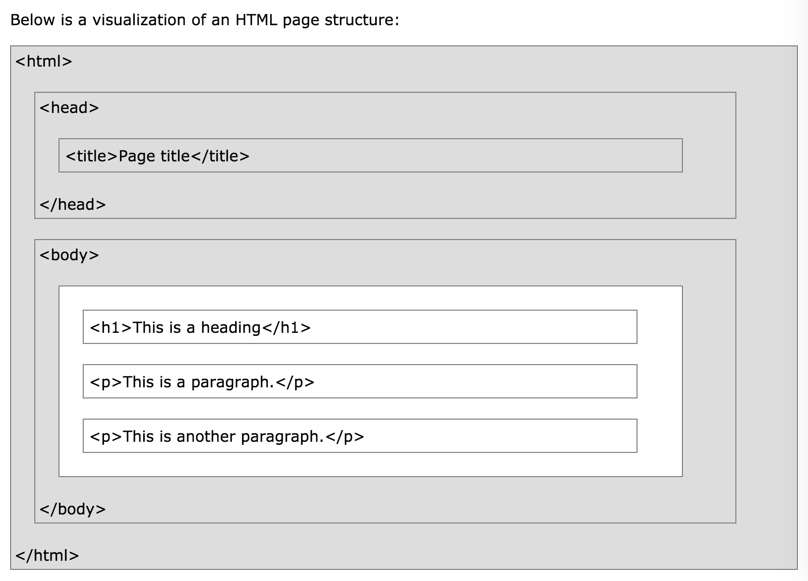

# HTML5 Tutorial

## HTML HOME

with HTML you can create your website

- [Examples](http://www.w3schools.com/html/html_examples.asp)
- [Exercises](http://www.w3schools.com/html/exercise.asp?filename=exercise_attributes1)
- [Quiz](http://www.w3schools.com/html/html_quiz.asp)
- [References](http://www.w3schools.com/tags/default.asp)
- [Exam](http://www.w3schools.com/cert/cert_html_new.asp)

## HTML Introduction

### What is HTML?

HTML is the standard markup language for creating Web pages

- Hyper Text Markup Language (HTML)
- describe the structure of Web pages using markup
- its elements are the building blocks of HTML pages
- its elements are represented by tags
- its tags label pieces of content such as "heading", "paragraph", "table", etc
- browsers use tags to render the content of the page

Explanations

- `<!DOCTYPE html>` : declaration, define the document to be HTML5
- `<html>`          : element, the root element of an HTML page
- `<head>`          : element, contain meta information about the document
- `<title>`         : element, specify a title for the document
- `<body>`          : element, contain the visible page content
- `<h1>`            : element, define a large heading
- `
`             : element, define a paragraph

### HTML Tags

tags are element names surrounded by angle brackets `<tagname>content goes here...</tagname>`

- tags normally come in pairs like `
` and `
`
- the first tag in a pair is the start tag, the second tag is the end tag (opening tag & closing tag)

### HTML Page Structure

> Only the content inside the `<body>` section is displayed in a browser

### The `<!DOCTYPE>` Declaration

- the declaration represents the document type, and helps browsers to display web pages correctly
- it must only appear onece, at the top of the page (before any HTML tags)
- it is not case sensitive
- for HTML: `<!DOCTYPE html>`

### HTML Versions

- 1991: HTML
- 1995: HTML 2.0
- 1997: HTML 3.2
- 1999: HTML 4.01
- 2000: XHTML
- 2014: HTML5

## HTML Editors

we believe using a simple text editor (like TextEdit in Mac) is a good way to learn HTML

- Name: index.htm (there is no difference between .htm and .html as file extension)
- Encoding: UTF-8

## HTML Basic

### HTML Documents

- all HTML documents must start with a **document type declaration**: `<!DOCTYPE html>`
- the HTML document itself begins with `<html>` and ends with `</html>`
- the **visible part** of the HTML document is between `<body>` and `</body>`

### HTML Headings

headings are defined with `<h1>` to `<h6>` tags

### HTML Paragraphs

paragraphs are defined with the `
` tag

### HTML Links

links are defined with the `<a>` tag

`<a href="http://www.w3schools.com">This is a link</a>`

link's destination is specified in the href attribute (attributes are used to provide additional information about HTML elements)

### HTML Images

images are defined with the `` tag

``

- src: source file
- alt: alternative text
- width: width
- height: height
- the above are provided as attributes

## HTML Elements

### HTML Elements

an element usually consists of a **start** tag and **end** tag, with the content inserted in between `<tagname>Content goes here...</tagname>`

- **element**: everything from the start tag to the end tag (start tag + element content + end tag)
- elements with no content are called **empty elements**, which do not have an end tag (like ` `)

### Nested HTML Elements

elements can be nested

- `<html>` : element, define the whole document; has a start tag and an end tag; the element **content** is another element (the `<body>` element)
- `<body>` : element, define the document body; the element **content** is two other elements (`<h1>` and `
`)
- `<h1>`   : element, define a heading; the element **content** is the sentence
- `
`     : element, define a paragraph; the element **content** is the sentence

### Do Not Forget the End Tag

some elements will display correctly, even if you forget the end tag: `
`, etc

Never rely on it!

### Empty HTML Elements

elements with no content; do not have an end tag (` `); can be "closed" in the opening tag like this: ` `

### Use Lowercase Tags

tags are not case sensitive: `
` means the same as `
`

recommend lowercase in HTML

## HTML Attributes

attributes provide additional information about elements

### HTML Attributes

- all elements can have attributes
- provide additional information about an element
- are always specified in the start tag
- usually come in name/value pairs like: `name="value"`

### The lang Attribute

the language of the document can be declared in the `<html>` tag with the **lang** attribute (it is important for accessibility applications and search engines) `<html lang="en-US">`

- `en`: specify the language
- if there is a dialect, use two more letters (US)

### The title Attribute

a title attribute is added to the `
` element, and the value will be displayed as a tooltip when you mouse over the paragraph `
This is a paragraph.
`

### The href Attribute

links are defined with the `<a>` tag and the link address is specified in the **href** attribute `<a href="http://www.w3schools.com">This is a link</a>`

### Size Attributes

images are defined with the `` tag ``

### The alt Attributes

alt attribute specifies an alternative text to be used, when an image cannot be displayed ``

### Suggest: Quote Attribute Values (double quotes)

## HTML Headings

### HTML Headings

headings are defined with the `<h1>` to `<h6>` tags

### HTML Horizontal Rules

`
` tag defines a thematic break in a page and is most often displayed as a horizontal rule; `
` element is used to separate content in a page

### The HTML `<head>` Element

`<head>` element has nothing to do with headings; it is a container for metadata ( data about the HTML document, which is not displayed); is placed between the `<html>` tag and the `<body>` tag

> metadata typically define the document title, character set, styles, links, scripts and other meta information

### HTML Tip - How to View HTML Source

in chrome: view page source

### HTML Tag Reference

- `<html>`       : define the root of an HTML document
- `<body>`       : define the document's body
- `<head>`       : a container for all the head elements(title, scripts, styles, meta information, and more)
- `<h1> to <h6>` : define HTML headings
- `
`         : define a thematic change in the content

## HTML Paragraphs

`
` element define a paragraph (browsers automatically add some white space (a margin) before and after a paragraph)

### HTML Display

the browser will remove any extra spaces and extra lines when the page is displayed

### Don't Forget the End Tag

dropping the end tag can produce unexpected results or errors

### HTML Line Breaks

` ` element defines a line break (a new line without starting a new paragraph); it is an empty tag (no end tag)

### The Poem Problem

`<pre>` element defines preformatted text; the text inside a `<pre>` element is displayed in a fixed-width font and it preserves both spaces and line breaks

## HTML Styles

### HTML Style Attribute

style attribute has the syntax: `<tagname style="property:value;">`

- property: a CSS property
- value: a CSS value

### HTML Background Color

background-color property defines the background color for an element `<tagname style="background-color:powerblue;">`

### HTML Text Color

color property defines the text color for an element `<tagname style="color:blue;">`

### HTML Fonts

font-family property defines the font to be used for an element `<tagname style="font-family:courier;">`

### HTML Text Size

font-size property defines the text size for an element `<tagname style="font-size:300%;">`

### HTML Text Alignment

text-align property defines the horizontal text alignment for an element `<tagname style="text-align:center;">`

### Chapter Summary

- style            : attribute, for styling elements
- background-color : property
- color            : property
- font-family      : property
- font-size        : property
- text-align       : property

## HTML Formatting

## HTML Quotations

## HTML Computercode

## HTML Comments

## HTML Colors

## HTML CSS

## HTML Links

## HTML Images

## HTML Tables

## HTML Lists

## HTML Blocks

## HTML Classes

## HTML Iframes

## HTML JavaScript

## HTML Head

## HTML Layout

## HTML Responsive

## HTML Entities

## HTML Symbols

## HTML Charset

## HTML URL Encode

## HTML XHTML
