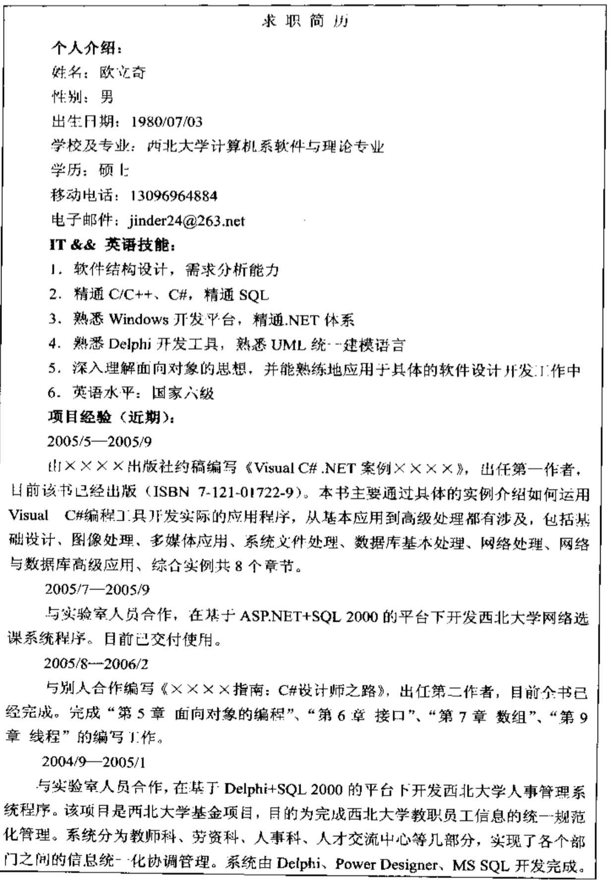
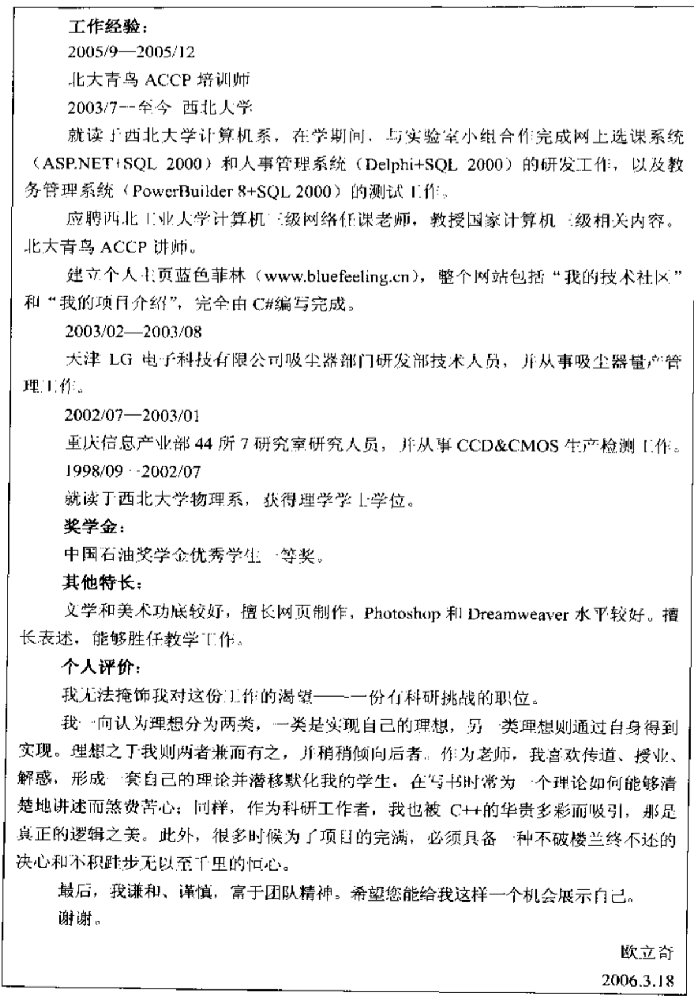
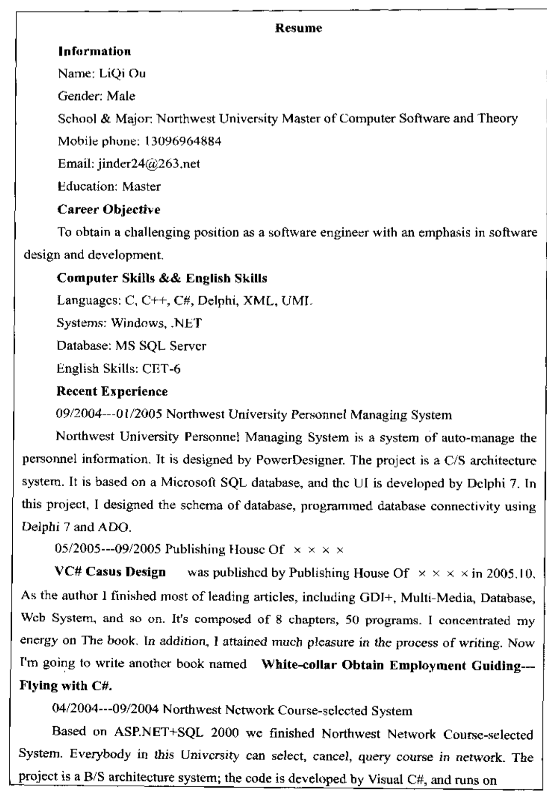
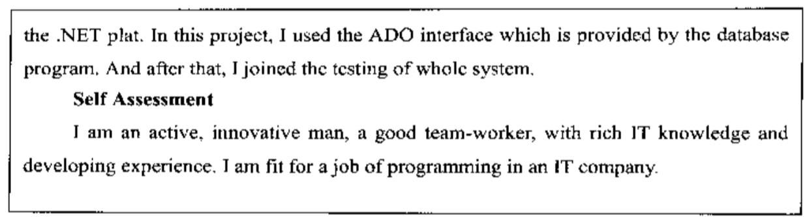

# 第2章 简历书写

## 2.1 简历注意事项

1. 简历不要太长（1分钟看完，中文简历压缩在2页左右，学习经历从大学开始，只列比较重要的荣誉）
2. 简历一定要真实客观（求职简历一定要按照实际情况填写，任何虚假的内容都不要写）
3. 不要过分谦虚（不要注水并不等于把一切，包括弱项都要写进去）
4. 简历上要写上求职的职位（一定要注明求职的职位，每份简历都要根据申请的职位来设计，突出这方面的优点；不要只准备一份简历，要根据工作性质有侧重地表现自己，突出自己相关的经历）
5. 在文字、排版、格式上不要出现错误
6. 简历不必做得太花哨
7. 简历言辞要简洁直白（最好多用动宾结构的句子）
8. 不要写上对薪水的要求
9. 不要写太多个人情况（姓名和电话是必需的，出生年月可选，其他可不写）
10. 不要用怪字怪体（简单的宋体5号字就好了）

## 2.2 简历模板

一份合格的求职简历应该包括：

- 姓名、电话（或其他联系方式）等个人资料应该放在简历的最上面
- 紧接着是毕业的学校、专业和时间
- 下面应该注明应聘的职位和目标
- 接下去是最重要的部分：工作经历。对应届生来说，这部分包括勤工助学、课外活动、义务工作、参加各种各样的团体组织、实习经历和实习单位的评价等。要写清楚你在社团中、在活动中做了哪些工作，取得什么成绩
- 兴趣爱好也最好列上两三项

简历范例

中文简历

英文简历

